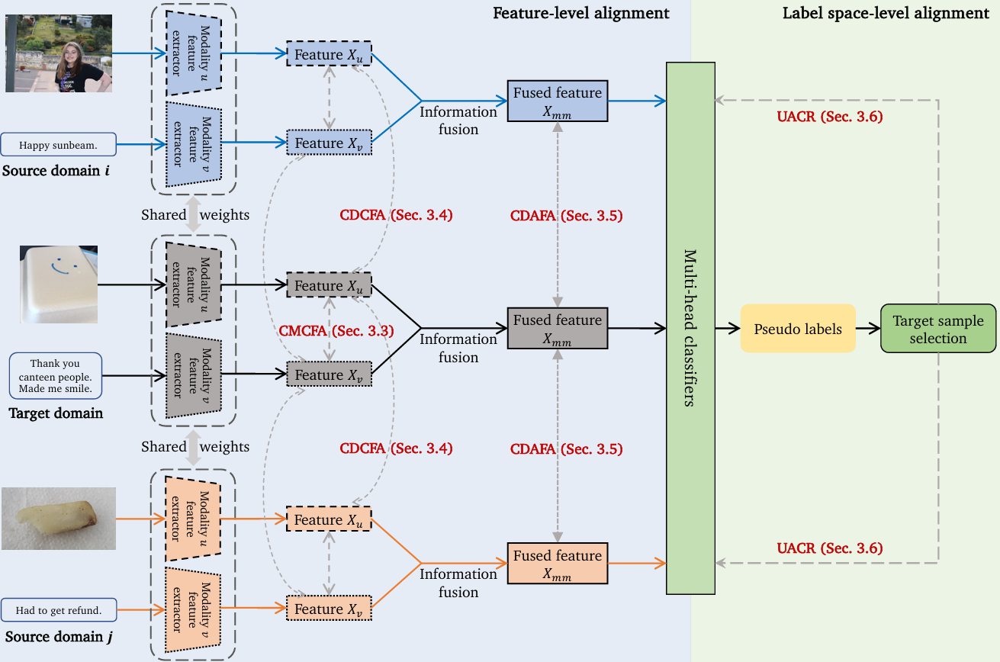

# Multi-Source Multi-Modal Domain Adaptation

> **Multi-Source Multi-Modal Domain Adaptation**<br>
>  Information Fusion 2024<br>

> **Abstract:** 
>
> *Learning from multiple modalities has recently attracted increasing attention in many tasks. However, deep learning-based multi-modal learning cannot guarantee good generalization to another target domain, because of the presence of domain shift. Multi-modal domain adaptation (MMDA) addresses this issue by learning a transferable model with alignment across domains. However, existing MMDA methods only focus on the single-source scenario with just one labeled source domain. When labeled data are collected from multiple sources with different distributions, the naive application of these single-source MMDA methods will result in sub-optimal performance without considering the domain shift among different sources. In this paper, we propose to study multi-source multi-modal domain adaptation (MSMMDA). There are two major challenges in this task: modal gaps between multiple modalities (e.g., mismatched text-image pairs) and domain gaps between multiple domains (e.g., differences in style). Therefore, we propose a novel framework, termed Multi-source Multi-modal Contrastive Adversarial Network (M2CAN), to perform alignments across different modalities and domains. Specifically, M2CAN consists of four main components: cross-modal contrastive feature alignment (CMCFA) to bridge modal gaps, cross-domain contrastive feature alignment (CDCFA), cross-domain adversarial feature alignment (CDAFA), and uncertainty-aware classifier refinement (UACR) to bridge domain gaps. CMCFA, CDCFA, and CDAFA aim to learn domain-invariant multi-modal representations by conducting feature-level alignments for each modality, within each domain, and on the fused representations, respectively. UACR performs label space-level alignment by progressively selecting confident pseudo labels for the unlabeled target samples to conduct self-learning and participate in alignment. After such feature-level and label space-level alignments, different source and target domains are mapped into a shared multi-modal representation space, and the task classifiers are adapted to both the source and target domains. Extensive experiments are conducted on sentiment analysis and aesthetics assessment tasks. The results demonstrate that the proposed M2CAN outperforms state-of-the-art methods for the MSMMDA task by 2.8% and 2.1% in average accuracy, respectively.*

## Table of Contents

- [Introduction](#Introduction)
- [Requirements](#Requirements)
- [Getting Started](#getting-started)
- [Citation](#Citation)

## Introduction



The framework of the proposed Multi-source Multi-modal Contrastive Adversarial Network (M2CAN). In order to reduce the modal gap and domain gap in MSMMDA, the source and target domains are aligned on both the feature level and label space level. Feature-level alignment considers the individual features for each modality and the fused features for multiple modalities. Label space-level alignment is based on the pseudo labels of target samples, of which only the selected highly confident ones participate in the training procedure of the classifiers.

## Requirements

- Linux
- Python >= 3.7
- PyTorch == 1.10.1
- opencv-python == 4.8.0.76
- CUDA (must be a version supported by the pytorch version)

## Getting Started

### data prepare

1. aesthetics
    1. [AVA](https://github.com/imfing/ava_downloader)
    2. [RPCD](https://github.com/mediatechnologycenter/aestheval)
    3. [PCCD](https://github.com/ivclab/DeepPhotoCritic-ICCV17)
2. sentiment
    1. [TumEmo](https://github.com/YangXiaocui1215/MVAN)
    2. [T4SA](http://www.t4sa.it/)
    3. [Yelp](https://github.com/PreferredAI/vista-net)

You can also download the zipped [datasets](https://drive.google.com/drive/folders/18KJOaWqd_Shpxb_vGutI93gtBqQK7b6R?usp=drive_link) provided by us.

The train-test subset split is in the directory [split](./split).

Please change the corresponding path in [config.py](./config.py).

The [checkpoints](https://drive.google.com/drive/folders/15Z4fvQRZmf-tEa8Wevw7E5cfdcVm210d?usp=sharing) of m2can based on ResNet50+BERT backbone have been made public.

### train

Take our **m2can** for example:

```bash
cd msmm/scripts/
bash train.sh $config [$gpu]
```

- `$config` denotes the config file, for example **config_AVA.yaml**
- `$gpu` denotes the id of GPU

### test

```bash
cd msmm/scripts/
bash test.sh $ckpt_dir [$gpu]
```

- `$ckpt_dir` denotes the checkpoint directory, for example **checkpoints_AVA**

## Citation

If you find M2CAN useful in your research, please consider citing:

```bibtex
TODO.
```
